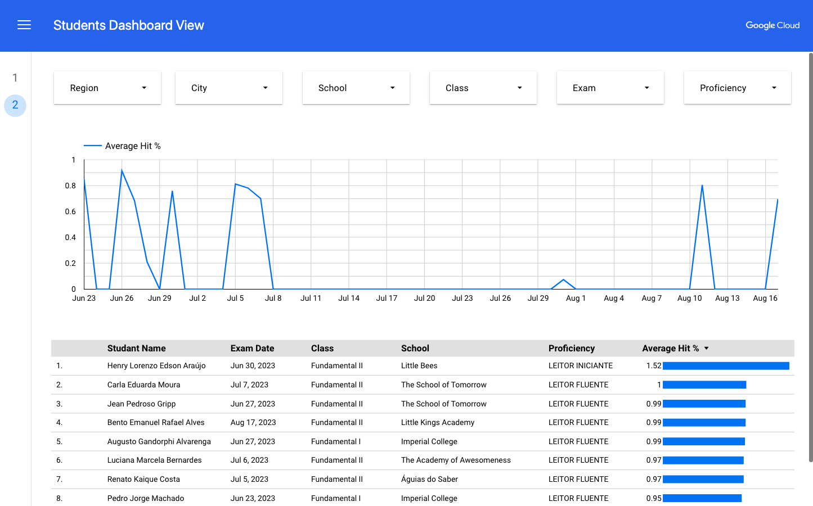
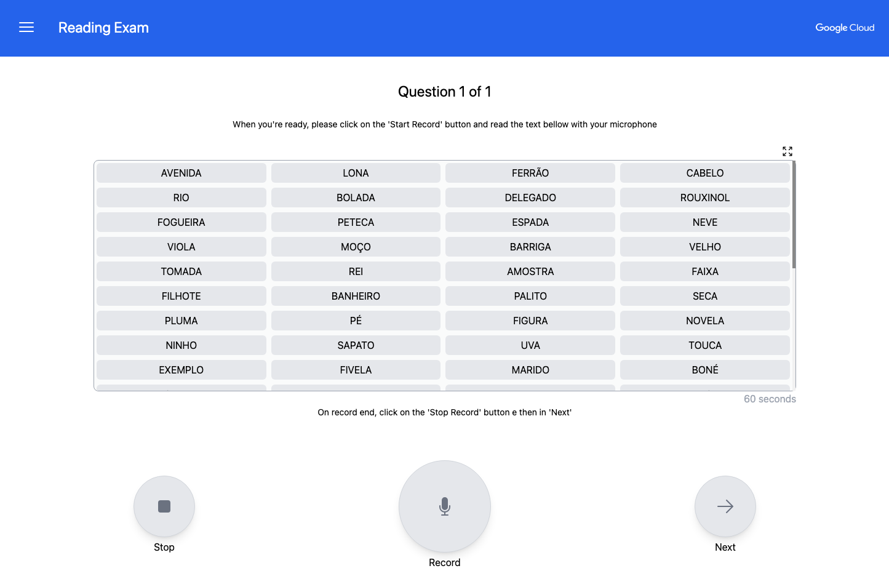
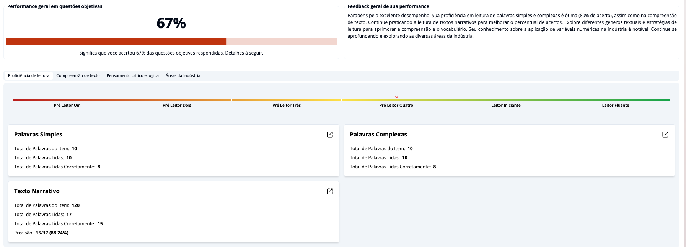
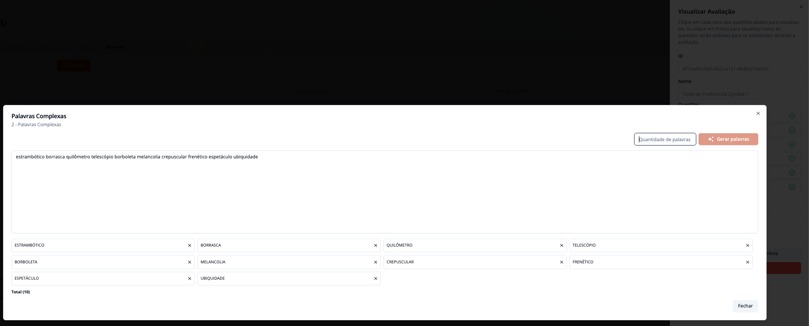
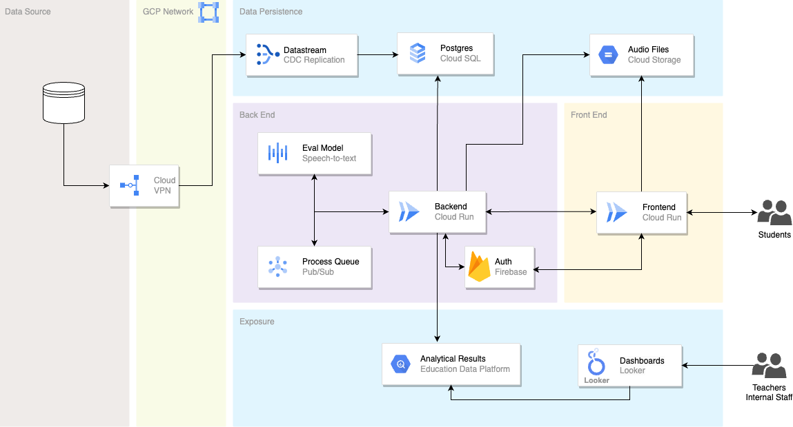

Functional illiteracy represents a profound and often underestimated challenge across the globe, confronting governments and societies worldwide. Far more complex than the mere inability to read or write, it signifies a deficit in the practical application of literacy skills necessary for navigating the demands of modern life. This article delves into the intricate nature of functional illiteracy, quantifies its pervasive impact across economic, health, and civic spheres, and explores the transformative potential of artificial intelligence (especially Generative AI) in fostering a more literate and equitable global society. It also introduces an open-source initiative we've been piloting at Google that targets that very need.

## The Silent Crisis: Understanding Functional Illiteracy

Functional illiteracy is a nuanced concept, distinct from absolute illiteracy where one shows a complete inability of performing basic cognitive activities, such as reading, writing, and so on (see the Figure 1 below).



Functional illiteracy extends beyond the rudimentary ability to decode words; it encompasses the practical application of reading, writing and applying logical and numerical skills in daily contexts. At its core, functional illiteracy refers to reading and writing skills that are "inadequate to manage daily living and employment tasks that require reading skills beyond a basic level". This definition highlights the practical, applied nature of the skill, emphasizing its necessity for navigating everyday responsibilities.

[The Barbara Bush Literacy Foundation](https://www.houstonadultliteracy.org/functionalliteracy) also describes it as "the lack of certain skills with an individual to properly function in their role on the job, in the family, and across society". Routine activities that are usually (but not restricted to) affected by functional illiteracy are:

* Making decisions about personal finances.
* Understanding a doctor’s advice or instructions for prescription drugs.
* Navigating transportation maps and schedules.
* Searching for and making an appointment online.
* Reading and following workplace safety manuals.
* Helping a child with homework and developing their literacy skills.
* Learning a new skill through an online platform.
* Among others.

A crucial aspect of functional illiteracy is its often "hidden" nature. The definition indicating an inability to understand complex texts despite adequate schooling or basic reading skills  directly implies that this challenge is not always apparent. 

This is further supported by research observations that "low literacy is often hidden or masked". Individuals may possess the fundamental ability to decode words or have completed a certain level of schooling, yet they struggle with the critical thinking, inference, and synthesis required by complex modern texts and tasks. 

This characteristic makes the problem particularly difficult to identify and address through conventional means, as traditional "literacy rates" (e.g., based on self-reporting or basic reading tests) can be misleading indicators of a population's true functional capabilities. Consequently, policy interventions and assessment methods must be sophisticated enough to uncover this pervasive yet subtle deficit, focusing on applied comprehension and critical evaluation rather than just foundational reading skills.

Because of that, its measurement is far more complex to assess, especially at scale, and requires sophisticated assessment tools. That alone naturally poses a pervasive, often hidden, problem for governments and educators, as it undermines individual potential and societal progress.

## The challenge is huge

There is nothing better than backing up assumptions with actual stats. After all as Deming once said "In God we trust; all others must bring data", so let's bring some data in.

As mentioned earlier, developing countries with higher levels of inequality and poverty present a stronger tendency to be hit harder by functional illiteracy as the efficiency of educational approaches also tends to be lower than it should be.

As a Brazilian native, I couldn’t leave this out of the analysis. As you might know, Brazil is the biggest country in Latin America and one of the biggest countries in the World being one of the biggest economies as well. Despite all that relevance, Brazil still holds high levels of poverty (approximately **59 million people** in the country live under World Bank's defined line of poverty) and social inequality, so it is a good example.

Despite the efforts made by Brazilian governments over the years, Reports [[1](https://borgenproject.org/illiteracy-crisis-in-brazil/), [2](https://publichealth.jhu.edu/2003/messias-brazil) and [3](https://agenciadenoticias.ibge.gov.br/en/agencia-news/2184-news-agency/news/40118-2022-census-illiteracy-rate-falls-from-9-6-to-7-0-in-12-years-though-inequalities-persist)] show that in 2022, for instance, the illiteracy rate in Brazil was around 7.0% of the population aged 15 years and over. Translating this to absolute numbers (considering the population of the country at the time) it means that approximately 11.4 million people in this age group were considered functionally illiterate. It represents a significant challenge for the country as, among other impacts already highlighted previously, it has also [impacted the population’s life expectancy](https://publichealth.jhu.edu/2003/messias-brazil).

Even in the United States, [recent studies](https://www.nu.edu/blog/49-adult-literacy-statistics-and-facts/) show that 54% of adults (approximatelly 130 million of Americans) read below a 6th-grade level and it has become evident that there is a national crisis of human capital, limiting innovation, productivity, and democratic participation in the country.

Something has to be done, urgently.

## Good news is: technology (powered by AI) can help

As stated earlier, the problem has been known and tried to be fought both private and public sectors for decades. Undoubtedly, it has been a noble (but very hard) fight that must be recognized. 

However, the struggle continues. Why? Well, mainly because despte all the efforts put in by educators on the subject, the scale of the problem (entire societies) associated with traditional models of education established, while well-intentioned, have been hampered by systemic limitations.

* Lack of Reach: Less than 10% of adults with low literacy skills are enrolled in an adult education program.
* Lack of personalization: One-size-fits-all approaches fail to address individual learning needs and paces.
* Limited accessibility: Geographic, economic, and social barriers prevent many from accessing quality education.
* Outdated curricula: Slow adaptation to technological and societal changes leaves learners unprepared for modern challenges.
* Insufficient resources: Many institutions lack funding, qualified teachers, and modern infrastructure.
* Passive learning: Emphasis on rote memorization over critical thinking and problem-solving.
* Inadequate assessment: Standardized tests often fail to measure practical skills and real-world literacy.

Today, however, we stand at the cusp of a technological revolution that promises to rewrite the rules of literacy instruction. Artificial Intelligence associated with the computational power of cloud computing platforms like [Google Cloud](https://cloud.google.com/) and others is emerging as a powerful force multiplier, offering personalized, <u>**scalable**</u>, and accessible solutions that were unimaginable just a few years ago.

AI directly addresses the core weaknesses of the traditional model. It is not a replacement for human teachers (teachers, it won't happen, rest assured) but rather a suite of powerful tools that can augment their efforts and reach learners who have been left behind.

Now, to be more specific, here are the main reasons by which AI is a strong ally to have by your side when fighting illiteracy:

* **Personalization at Scale**: AI-based systems can assess a user's skill level in real-time and tailor the content, difficulty, and pace of instruction to their specific needs. This provides a level of individualized attention that is impossible to replicate in a conventional classroom with one teacher and many students.   

* **24/7 Accessibility**: AI learning tools are available on a smartphone, tablet, or computer at any time of day or night. This overcomes the significant real-world barriers—such as inflexible work schedules, childcare needs, and lack of transportation—that often prevent adults from attending in-person classes.   

* **A Non-Judgmental Environment**: Learning with an AI tutor removes the fear of judgment. It provides a private, safe space for adults to make mistakes, ask basic questions, and learn at their own pace without the embarrassment or shame that can be a major psychological hurdle.

The greatest strength of AI in this context is its ability to decouple high-quality, personalized instruction from the finite limits of human and financial resources. A single, well-designed AI platform can provide one-on-one assessment + tutoring experience to one person or one million people simultaneously for a negligible marginal cost. This fundamentally changes the economic and logistical calculus of adult education, making it possible to finally reach the 90% of adults in need who are currently unserved.

This convergence (powerfull AI models + computational power + modularized architecture + affordable costs) has never happened before and it is our absolute duty to take advantage of it and create something that can help fight illiteracy at scale.

## Introducing an AI-based experiment: AIRA

While the general-purpose AI tools available today offer tremendous promise, the future of AI in literacy education lies in specialized solutions designed for specific pedagogical tasks. 

A prime example of this next wave of innovation is the Artificial Intelligence Reading Assessor, or just **AIRA**, an <a href="https://github.com/googlecloudplatform/aira" target="_blank" style="color: blue;">open-source</a> experiment developed by Google Cloud Education Engineers. AIRA provides a powerful glimpse into how data-driven AI can transform literacy instruction from a process of broad remediation into one of precise, targeted intervention.

**Figure 1**. One of the "Students" dashboards produced by AIRA

Originally, AIRA was designed to help organizations to assess reading gaps at scale with students of all ages and then, on top of the data collected, to provide a clear picture about reading gaps across the organization with the possility of filtering by City, School, Grade, Proficiency level, and more.

However, as we delved in more use cases directly connected to illiteracy it became clear to us that small adjustments on the "judgment" engine of the service would allow it to evaluate much more than just reading. Among other things it could evaluate logic on rationalizing situations, writing, problem solving capacity, and more. So, we did!

As of today, AIRA is a complete solution capable evaluating multidimensional aspects of a person's profile and generate personalized evaluation and feedback (directly to the student or at the organizational level) on top of that data produced.

It has also been used as a complimentary solution to [**Read Along**](https://readalong.google.com/) customers. That's because while Read Along focused more on students practicing reading on their own, AIRA can assess the effectiveness and reading progress of that process.

## How does AIRA work for users?

AIRA is primarely a responsive web application that has been designed to be a super simple solution to operate, capable of supporting its four main personas: **Students**, **Educators**, **System Administrators** and **Managers**. Below you can see the details of each.

### Students 

Students are the primary audience of the platform. They perform tests and can use agents to interact with their results, which is also delivered directly through the platform. Figure 2 showcases one of the tests students can perform within the tool.

**Figure 2**. Student performing one of the tests within the tool

### Educators 

Educators can both impersonate login for children and get them ready to perform the tests and can also visualize results of the tests their students perform with the tool. They can also interact with those results directly through the dashboard if they desire to do so. Figure 3 showcases an educator going through the results of one of their students.

**Figure 3**. Educator interacting with student's results (image's example in Brazilian Portuguese)

### System Administrators

These are the folks who have the highest priviledges within the system. They can do everything students and educators can, CRUDing data like "students", "grades", "cities", "schools", "tests", "rubrics", so on so forth. Figure 4 showcases the Sys Admin creating a new test within the system.

**Figure 4**. Sys Admin creating a new "complex words" type of question and tying it to an exam

It does all this while relying in a very robust cloud native and event-based non-functional architecture in Google Cloud, which enables it to scale up and down  and horizontally as demand grows or slows down.

### Managers

Last but not least, Managers. These are the individuals that can take a deeper look into the data. They have the most advanced ways to drill in into the data being produced by <u>all</u> schools, <u>all</u> grades, <u>all</u> cities, <u>all</u> states, so on so forth.

As decision makers, they have to have the ability to create pictures on top of the data and be informed about what to do next towards implementing policies to improve readiness against the illiteracy flags being raised.

Figure 5 depicts onde of the multiple possible reports a Manager can delve into from its administrative dashboard.

### AIRA's main features and types of tests

As you can see, AIRA relies on a strong pedagogical foundation tied to strong set of technologial resources to allow organizations to first, map illiteracy at different levels and then, if applicable, act on top of those.

To do that, the solution builds up on set of unique functionalities, which the most important ones are highlighted below.

* Measurement of foundational reading (random and complex words)
* Measurement of rationality
* Measurement of problem solving
* Pitch evaluation
* Conversational agent to interact with illiteracy data
* Analytical dashboards segmented by multiple dimensions
* Login impersonation
* Integration with Google Workspace for authentication and data ingestion
* Consolidated report for students
* Among others

## What's under-the-hood?

AIRA uses a combination of Google Cloud services to give life to the functionalities listed earlier. 

For instance, it leverages [Google Cloud's Speech to Text API](https://cloud.google.com/speech-to-text?hl=en) to automatically convert people's reading sentences (an audio file captured as input to most questions) into text. 

From there, it leverages [Gemini 2.5 Pro](https://deepmind.google/models/gemini/pro/) (as another layer of intelligence), to analyze scores against rubrics and classify phonetical reading performance.

It also utilizes multiple Google Cloud services to guarantee performance, resiliency and mainly, scalability to solutions components, as you can see through the non-functional architecture depicted by Figure 6.

**Figure 6**. General non-functional architecture for AIRA

The general flow of communication (from the right to the left) and the role of each cloud component is described below.

### Frontend 

Organizations will always need to select a type of User Interface (UI) to offer the solution's functionalities to final users. It can be a web interface (like an intergration via REST APIs with a pre-existing LMS like Moodle, for instance), a mobile app, conversational chat bot, etc. 

In the representation offered by Figure 6, we assume that the frontend is delivered by a web application (which is the most common case we've seen), which might be, eventually, hosted by <a href="https://cloud.google.com/run" target="_blank">Cloud Run</a> service.

> It isn't represented there, but it is pretty common for customer deploying it in production to have a load balancer with <a href="https://cloud.google.com/security/products/armor" target="_blank">Cloud Armor</a> and <a href="https://cloud.google.com/cdn" target="_blank">Cloud CDN</a> tied to it to add elevated levels of security to requests and increment of performance on delivering  static files.

### Audio files

Audio files are the heart of how AIRA works and are collected across all types of  assessments within the solution. Once produced in the frontend, they're sent for processing to the backend and are stored in <a href="https://cloud.google.com/storage" target="_blank">Cloud Storage</a> service.

Other static files like images and also those used for grouding with the models are also hosted in Cloud Storage.

### Backend

The backend receives, orchestrates and manages all the incoming requests from the frontend or others sources of integration that might be in place. The original architecture recommends it to be hosted with Cloud Run, but it is not uncommon to see customers publishing it to a <a href="https://cloud.google.com/kubernetes-engine" target="_blank">Google Kubernetes Engine (GKE)</a> for more control and connectivity granularity.

> AIRA's backend ir writen in Python and its public repository brings all the scripts to build and publish its container image into Cloud Run.

### Authentication

AIRA currently supports two types of authentication methods, both structured on top of <a href="https://firebase.google.com/" target="_blank">Firebase</a> service.

1. Organizations can create a custom process of authentication/authorization, which means users will need to create new accounts (with usernames and passwords).
2. Organizations already using <a href="https://workspace.google.com/" target="_blank">Google Workspace</a> can benefit of a native federation of credentials so that users don't need to create new credentials. It is configurable directly through the deployment script.

This component, obviously, works in direct communication with both backend and frontend.

### Database

All the relational data generated by the application is originally persisted in a <a href="https://cloud.google.com/sql/postgresql" target="_blank">Cloud SQL for Postgres</a>. All that communication is directly managed by the backend.

### Big Query & Education Data Platform (EDP)

Analytical data gravitates towards <a href="https://cloud.google.com/bigquery" target="_blank">Big Query</a> service. All the information populated through the analytical tools (like Looker, Power BI, etc) will be pulled from there.

Agents and other AI-based functionalities implemented with the tool that look up to the generated analytical data to get trained or executed are also relying in Big Query.

> <a href="https://github.com/googlecloudplatform/education-data-platform" target="_blank">Education Data Platform (EDP)</a> is an open-source enterprise-grade data platform with pre-made connectors for Education's common platforms in Education that make it easier for organizations to spin up these types of environments. It brings everything in one single place (repo) to deploy and use  that infrastructure. Because some customers have EDP spun up alongside AIRA, the architecture above also contemplates that integration.

### Vertex AI

Everything related to AI (meaning resources like models, services and APIs) lives on <a href="https://cloud.google.com/vertex-ai" target="_blank">Vertex AI</a> service within Google Cloud. In the particular case of AIRA's implementation, two resources are massevely leveraged: Speech-To-Text API and Gemini.

Depending on the type of operation being performed, AIRA's backend then handles the requests to respective APIs and orquestrate those responses. For instance, when a new audio sent by the user hits the backend, it might be sent for processing to STT service in Vertex AI for text transformation. Same goes for Gemini and its underlying operations.

Those resources get provisioned and configured at deployment time, alongise other cloud resources.

### PubSub

<a href="https://cloud.google.com/pubsub?hl=en" target="">PubSub</a> is the managed queue service that allows us to decouple operations in the backend favoring better horizontal scalability for the underlying services.

Among the examples we use PubSub for are: processing reading audio from students, score generation, question correction, among others.

## Results

AIRA is now being used by several customers (both in public and private sectors) in Latin America. State of Parana in Brazil was the very first government agency interested on working with Google Cloud engineers to tackle the issue posted in this article. 

The results were very satisfactory and they have now rolled out the solution to the entire state. The <a href="https://cloud.google.com/customers/intl/pt-br/seed-pr?hl=pt-BR" target="_blank">success case</a> (in Brazilian-portuguese) was published by Google Cloud recently.

What we've learned after months of the solution in producttion with customers like Parana State is that, this detailed, objective data can really be transformative. That's because it allows an educator to see, for example, that a particular student consistently struggles with words containing a specific vowel digraph or has a slow reading pace that impedes comprehension. This insight enables the creation of hyper-targeted interventions. Instead of generic reading practice, the educator can assign specific phonics drills or fluency exercises that address the student's precise area of weakness, making instructional time dramatically more effective.

## Next steps

If you like the idea AIRA brings, you should feel empowered to:

* Go to solution's repository to get youself familiarized with the solution.
* If you have an active Google Cloud account, to deploy and play with it.
* If you see applicability of the solution in your context but is not so sure about how to put this to work in your organization, make sure to reach out to your Google Cloud representative. They will know how to best direct you to the best resources.
* Directly contribute with the project by sending your Pull Requests direct into the repository.